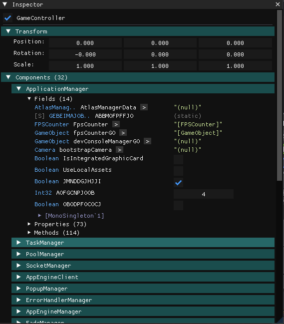

# MDB Explorer (ImGui)

A powerful runtime Unity scene explorer for IL2CPP games, built with Dear ImGui. Inspect GameObjects, Components, and their members in real-time with full IL2CPP reflection support. Includes a built-in deobfuscation tool for mapping obfuscated names to human-readable equivalents.

---

<a href="https://buymeacoffee.com/winnforge">
  
</a>

## Features

### Scene Hierarchy
Browse and navigate through all loaded Unity scenes and their GameObjects in a tree view.


- Expandable tree structure showing parent-child relationships
- Click to select and inspect GameObjects
- Deobfuscation toolset integration for setting and viewing friendly names

### Inspector Panel
View and interact with selected GameObjects and their Components.



- **Fields** - View and edit field values
- **Properties** - Read property values with getter invocation
- **Methods** - View available methods on components
- **Drill-through Navigation** - Click on object references to navigate deeper into the object graph
- **Inheritance Grouping** - Members are grouped by declaring class with collapsible sections
- **Right-click Context Menus** - Copy names and values to clipboard

### Deobfuscation Tool
Built-in deobfuscation panel for mapping obfuscated class/field/property/method names to human-readable names.


- Search and browse obfuscated names
- View and edit friendly name mappings
- Real-time preview of deobfuscated names throughout the Explorer

## Requirements

- [MDB Framework](https://github.com/Zaclin-GIT/MDB/tree/main)
- Target game using IL2CPP Unity runtime
- DirectX 11 (for ImGui rendering)

## Installation

1. Build the project
2. Copy the compiled DLL to your game's `MDB/Mods/` folder

## Usage

1. Launch the game with MDB Framework loaded
2. Open the menu in the top right corner "MDB Explorer"
3. Enable panels via the menu:
   - **Scene Hierarchy** - Browse scene objects
   - **Inspector** - View selected object details
   - **Deobfuscation** - Manage name mappings
4. Click on GameObjects in the hierarchy to inspect them
5. Click on object references in the inspector to drill down

## Building

```bash
dotnet build -c Release
```

## License

MIT License - See LICENSE file for details.
