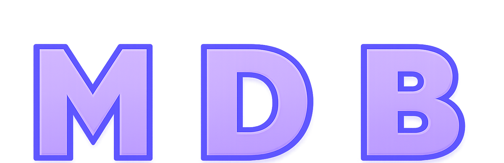

<p align="center">
  
</p>

---

<p align="center">
  <a href="https://github.com/Zaclin-GIT/MDB/releases/latest"></a>
  <a href="https://github.com/Zaclin-GIT/MDB/releases"></a>
</p>

<p align="center">
  <a href="https://buymeacoffee.com/winnforge"></a>
</p>

---

Inject `MDB_Bridge.dll` into any Unity IL2CPP game (x64). The framework automatically dumps metadata, generates C# wrappers, compiles an SDK, hosts the .NET CLR, and loads your mods.

Encrypted `global-metadata.dat`? Don't care.

> [!WARNING]
> Early development. Expect breaking changes.

---

## GENERAL INFORMATION

- All Logs are created in `MDB/Logs/` inside the game folder.
- All Mods get placed in `MDB/Mods/` inside the game folder.
- The SDK (`GameSDK.ModHost.dll`) is auto-generated in `MDB/Managed/` on first injection.
- Subsequent launches skip dump & build if nothing has changed.

| Guides | |
| - | - |
| [Getting Started](https://zaclin-git.github.io/MDB/getting-started) | Install and create your first mod |
| [API Reference](https://zaclin-git.github.io/MDB/api) | Complete API documentation |
| [Examples](https://zaclin-git.github.io/MDB/examples) | Working mod examples |

| Example Projects | |
| - | - |
| [HelloWorld](Documentation/Examples/HelloWorld) | Lifecycle, Logger, basic ImGui |
| [UnityDebugInterceptor](Documentation/Examples/UnityDebugInterceptor) | Declarative patching |
| [GameStats](Documentation/Examples/GameStats) | Advanced patching, IL2CPP Bridge |
| [MDB_Explorer_ImGui](Documentation/Examples/MDB_Explorer_ImGui) | Full IL2CPP reflection, scene traversal |

---

## FEATURES

- **Zero-configuration** — Inject one DLL, everything else is automatic
- **Runtime IL2CPP dumping** — No external tools, works with encrypted metadata
- **C# wrapper generation** — Type-safe wrappers with generic type resolution
- **Harmony-style patching** — `[Prefix]`, `[Postfix]`, `[Finalizer]` attributes
- **RVA-based hooking** — Target obfuscated methods directly by address
- **Built-in Dear ImGui** — DX11/DX12 overlay with input capture (F2 toggle)
- **Deobfuscation support** — Automatic name sanitization and mapping (WIP)

---

## REQUIREMENTS

- **Windows 10/11 (x64)**
- **Visual Studio 2022** with C++ and .NET desktop workloads
- **.NET Framework 4.7.2+**
- **A Unity IL2CPP game (x64)** — look for `GameAssembly.dll` in the game folder
- **DLL injector**

---

## QUICK START

1. Build or download `MDB_Bridge.dll` and `MDB_Core/`
2. Copy both to the game's root folder
3. Inject `MDB_Bridge.dll` into the running game
4. Wait for the SDK to auto-generate (first launch only)
5. Drop mod DLLs into `MDB/Mods/`

See the [Getting Started](https://zaclin-git.github.io/MDB/getting-started) guide for detailed instructions.

---

## BUILDING

**MDB_Bridge** (C++17, MSVC v143):
```
msbuild MDB_Bridge.vcxproj /p:Configuration=Release /p:Platform=x64
```

**MDB_Core** (.NET Framework 4.7.2):
```
dotnet build MDB_Core.csproj -c Release
```

---

## PLATFORM COMPATIBILITY

|            | Windows | Linux | macOS |
|------------|---------|-------|-------|
| IL2CPP x64 | ✔️     | ❌    | ❌    |
| IL2CPP x86 | ❌     | ❌    | ❌    |
| Mono       | ❌     | ❌    | ❌    |

---

## USED LIBRARIES

- [Dear ImGui](https://github.com/ocornut/imgui)
- [MinHook](https://github.com/TsudaKageyu/minhook)

## ACKNOWLEDGMENTS

Inspired by the excellent work of:
- [MelonLoader](https://github.com/LavaGang/MelonLoader)
- [BepInEx](https://github.com/BepInEx/BepInEx)
- [Il2CppDumper](https://github.com/Perfare/Il2CppDumper)
- [Il2CppAssemblyUnhollower](https://github.com/knah/Il2CppAssemblyUnhollower)
- [Il2CppRuntimeDumper](https://github.com/kagasu/Il2CppRuntimeDumper)

These projects paved the way. MDB Framework just takes a different route to the same destination.

---

## DISCLAIMER

**This framework is provided "as-is" for educational and research purposes only.**

The author(s) of MDB Framework are **not responsible** for any consequences resulting from the use or misuse of this software. This includes but is not limited to:

- **Game bans or account suspensions** - Many games prohibit modding in their Terms of Service
- **Anti-cheat detections** - Using this framework may trigger anti-cheat systems
- **Data loss or corruption** - Modifying game memory can cause crashes or save corruption
- **Legal consequences** - Violating a game's EULA may have legal implications

**Before using MDB Framework:**

1. **Read the game's Terms of Service** - Respect the rules set by game developers
2. **Never use in online/multiplayer games** - This can ruin the experience for others and result in permanent bans
3. **Use only for single-player experimentation** - Or games that explicitly allow modding
4. **Understand the risks** - You are solely responsible for your actions

By using this framework, you acknowledge that you understand these risks and agree to use the software responsibly and ethically.