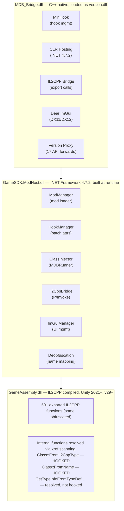
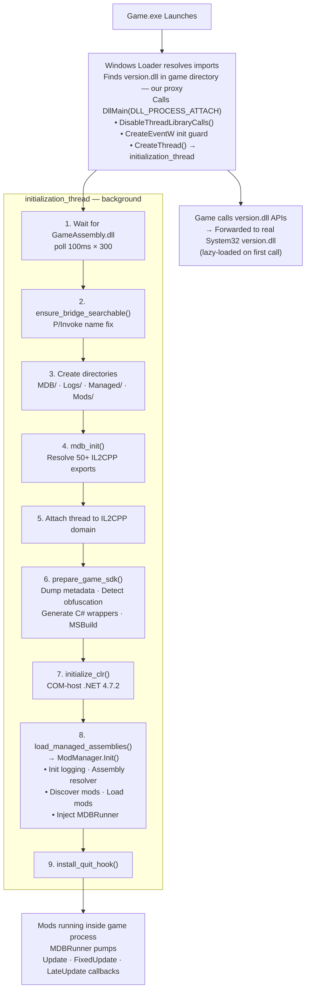
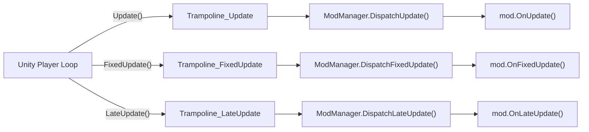

# Architecture Overview

This guide covers MDB Framework's complete architecture — from the moment the game launches to mods running on Unity's main thread. It ties together the [proxy injection system]({{ '/guides/proxy-injection' | relative_url }}) and [managed class injection]({{ '/guides/class-injection' | relative_url }}) into a single coherent picture.

---

## Table of Contents

1. [Component Architecture](#component-architecture)
2. [The Full Injection Chain](#the-full-injection-chain)
3. [Initialization Sequence](#initialization-sequence)
4. [IL2CPP Export Resolution](#il2cpp-export-resolution)
5. [Runtime SDK Generation](#runtime-sdk-generation)
6. [.NET CLR Hosting](#net-clr-hosting)
7. [Mod Discovery and Loading](#mod-discovery-and-loading)
8. [Main-Thread Dispatch](#main-thread-dispatch)
9. [Application Shutdown](#application-shutdown)
10. [File Reference](#file-reference)

---

## Component Architecture

MDB Framework consists of three layers:



### MDB_Bridge.dll (Native C++)

The native bridge is the entry point. It handles:
- **Version proxy forwarding** — transparently forwarding 17 `version.dll` API calls to the real system DLL
- **IL2CPP bridge** — 800+ exported functions providing P/Invoke access to IL2CPP internals
- **CLR hosting** — hosting the .NET Framework 4.7.2 runtime via COM interfaces
- **IL2CPP metadata dumping** — enumerating all assemblies, classes, methods, fields, and properties
- **C# code generation** — generating type-safe C# wrapper source files
- **MSBuild invocation** — compiling the generated wrappers into the modding SDK
- **Dear ImGui overlay** — DX11/DX12 swap chain hooking and ImGui rendering
- **MinHook management** — native API hooking (Application.Quit, DirectX vtables)

### GameSDK.ModHost.dll (Managed C#)

The managed layer is compiled at runtime from `MDB_Core/` source files plus auto-generated wrappers. It handles:
- **Mod discovery and loading** — scanning `MDB/Mods/` for mod DLLs
- **Patch attribute processing** — parsing `[Patch]`, `[Prefix]`, `[Postfix]`, `[Finalizer]` attributes
- **MonoBehaviour fabrication** — constructing IL2CPP metadata for the MDBRunner class
- **Main-thread dispatch** — routing Update/FixedUpdate/LateUpdate callbacks to mods
- **IL2CPP abstraction** — type-safe C# wrappers for all game types

### GameAssembly.dll (Unity IL2CPP)

The game's compiled C# code, ahead-of-time compiled to native code by Unity's IL2CPP toolchain. MDB interacts with it through exported functions and, for class injection, through two hooked internal functions.

---

## The Full Injection Chain



---

## Initialization Sequence

All heavy work happens in a background thread spawned from `DllMain`. This is critical because `DllMain` runs under the Windows loader lock, where calling `LoadLibrary`, `GetProcAddress` on other DLLs, or managed code would cause deadlocks.

### Step 1: Wait for GameAssembly.dll

```cpp
HMODULE hGameAssembly = nullptr;
for (int i = 0; i < 300 && !hGameAssembly; ++i) {
    hGameAssembly = GetModuleHandleA("GameAssembly.dll");
    if (!hGameAssembly) Sleep(100);
}
```

The proxy loads very early — often before Unity has loaded the IL2CPP runtime. We poll for up to 30 seconds. If `GameAssembly.dll` isn't found, the game probably isn't IL2CPP and we abort.

### Step 2: Ensure Bridge Is Searchable

In proxy mode, our DLL is loaded as `version.dll`, but C# code uses `[DllImport("MDB_Bridge.dll")]`. The `ensure_bridge_searchable()` function copies the proxy DLL to `MDB/MDB_Bridge.dll` and pre-loads it by full path, so P/Invoke can resolve the bridge. A named event guard prevents this second load from re-initializing.

See [Proxy DLL Injection — P/Invoke Bridge Name Resolution]({{ '/guides/proxy-injection' | relative_url }}#pinvoke-bridge-name-resolution) for details.

### Step 3: Create Directory Structure

Creates the required folder layout if it doesn't exist:

```
MDB/                    ← Framework root
MDB/Logs/               ← Log files
MDB/Managed/            ← Built SDK output
MDB/Mods/               ← User mod DLLs
MDB_Core/               ← C# project sources
MDB_Core/Generated/     ← Auto-generated C# wrappers
```

### Step 4: Initialize IL2CPP Bridge

Resolves 50+ function pointers from `GameAssembly.dll` using a 3-strategy fallback chain. See [IL2CPP Export Resolution](#il2cpp-export-resolution) below.

### Step 5: Attach Thread to IL2CPP Domain

IL2CPP requires explicit thread registration before API calls from non-Unity threads:

```cpp
void* domain = mdb_domain_get();
if (domain) mdb_thread_attach(domain);
```

### Step 6: Prepare Game SDK

The heaviest step — dumps all metadata, generates C# wrappers, and compiles the SDK. See [Runtime SDK Generation](#runtime-sdk-generation).

### Step 7: Initialize .NET CLR

Hosts .NET Framework 4.7.2 via COM interfaces. See [.NET CLR Hosting](#net-clr-hosting).

### Step 8: Load Managed Assemblies

Calls `ModManager.Initialize()` in the hosted CLR. See [Mod Discovery and Loading](#mod-discovery-and-loading).

### Step 9: Install Quit Hook

Hooks `Application.Quit()` for clean shutdown. See [Application Shutdown](#application-shutdown).

---

## IL2CPP Export Resolution

**File:** `MDB_Bridge/src/il2cpp/il2cpp_resolver.hpp`

To interact with the game's IL2CPP runtime, we need function pointers to 50+ exports from `GameAssembly.dll`. The resolver uses a **3-strategy fallback chain**:

### Strategy 1: Standard GetProcAddress

```cpp
auto ptr = GetProcAddress(hGameAssembly, "il2cpp_domain_get");
```

Works for unobfuscated games that export IL2CPP functions under their canonical names.

### Strategy 2: Cached Obfuscation Map

If a previous PE scan mapped obfuscated names to canonical equivalents, look up the cached mapping.

### Strategy 3: Suffix-Based PE Export Scan

Some games (particularly those using BeeByte obfuscation) rename IL2CPP exports by appending suffixes like `_wasting_your_life`. The resolver walks the PE export directory and matches exports ending with known obfuscation suffixes.

### Resolution Categories

| Category | Behavior | Examples |
|----------|----------|----------|
| **Core** (required) | Missing = abort | `il2cpp_domain_get`, `il2cpp_thread_attach`, `il2cpp_class_from_name` |
| **Introspection** (best-effort) | Missing = reduced capabilities | `il2cpp_image_get_class_count`, `il2cpp_class_get_methods` |
| **Generics** (best-effort) | Missing = silently ignored | `il2cpp_method_get_object`, `il2cpp_method_get_from_reflection` |
| **Strings / Objects** | Required for mod execution | `il2cpp_string_new`, `il2cpp_object_new`, `il2cpp_runtime_invoke` |

---

## Runtime SDK Generation

**Files:** `MDB_Bridge/src/il2cpp/il2cpp_dumper.hpp/.cpp`, `MDB_Bridge/src/codegen/build_trigger.hpp/.cpp`

Every IL2CPP game has a unique type system. MDB generates a per-game SDK at runtime:

### Dumper Process

1. Call `il2cpp_domain_get_assemblies()` to enumerate all assemblies
2. For each assembly, get the image and iterate all classes via `il2cpp_image_get_class()`
3. For each class, extract methods, fields, and properties
4. Run **obfuscation detection** — BeeByte-style fake method/class filtering
5. Apply **deobfuscation name mappings** if available
6. Resolve **generic type arguments** at runtime (`List<string>` stays `List<string>`)
7. Generate compilable C# source files into `MDB_Core/Generated/`
8. Write a **freshness marker** so subsequent launches skip this step

### MSBuild Invocation

The build trigger locates MSBuild via:
1. `vswhere.exe` (preferred — queries VS installer for the latest MSBuild)
2. Hardcoded paths for Visual Studio 2022/2019

Then invokes:
```
msbuild MDB_Core.csproj /restore /p:Configuration=Release /p:Platform=AnyCPU /v:minimal /nologo
```

Output is captured via anonymous pipes for logging. The compiled `GameSDK.ModHost.dll` goes to `MDB/Managed/`.

> **Trade-off:** This requires Visual Studio to be installed. We accepted this because the target audience is mod developers, not end users.

---

## .NET CLR Hosting

**File:** `MDB_Bridge/src/core/dllmain.cpp`

MDB hosts the .NET Framework CLR (not .NET Core, not Mono) using COM-based hosting APIs:

```cpp
// 1. Get the CLR MetaHost
CLRCreateInstance(CLSID_CLRMetaHost, IID_ICLRMetaHost, (void**)&g_pMetaHost);

// 2. Get runtime info for .NET Framework 4.x (v4.0.30319 covers 4.0 through 4.8.x)
g_pMetaHost->GetRuntime(L"v4.0.30319", IID_ICLRRuntimeInfo, (void**)&g_pRuntimeInfo);

// 3. Verify the runtime is loadable
g_pRuntimeInfo->IsLoadable(&loadable);

// 4. Get the runtime host interface
g_pRuntimeInfo->GetInterface(CLSID_CLRRuntimeHost, IID_ICLRRuntimeHost, (void**)&g_pRuntimeHost);

// 5. Start the CLR
g_pRuntimeHost->Start();
```

### Why .NET Framework?

- **Ubiquity** — .NET Framework 4.x is pre-installed on every modern Windows system
- **Simple COM hosting** — well-documented, stable API surface
- **Compatibility** — works well with the P/Invoke patterns used throughout MDB

### Loading Managed Assemblies

`ExecuteInDefaultAppDomain` invokes the managed entry point:

```cpp
g_pRuntimeHost->ExecuteInDefaultAppDomain(
    L"..\\MDB\\Managed\\GameSDK.ModHost.dll",   // Path to managed DLL
    L"GameSDK.ModHost.ModManager",               // Full type name
    L"Initialize",                                // Static method name
    L"",                                          // String argument
    &retVal                                       // Return value (int)
);
```

The target method must match this constrained signature:
```csharp
public static int Initialize(string args);
```

This is a limitation of the CLR hosting API, but sufficient for bootstrapping — `ModManager.Initialize()` handles everything else from the managed side.

---

## Mod Discovery and Loading

`ModManager.Initialize()` orchestrates all managed-side initialization:

1. **Initializes logging** — sets up file-based logging in `MDB/Logs/`
2. **Registers an assembly resolver** — custom `AppDomain.AssemblyResolve` handler that looks in `MDB/Managed/` and `MDB/Mods/` for dependencies
3. **Initializes the IL2CPP runtime** — P/Invoke calls back into `MDB_Bridge.dll` to set up the managed IL2CPP abstraction layer
4. **Discovers mods** — scans `MDB/Mods/` for `.dll` files, finds types inheriting `ModBase` with valid `[Mod]` attributes
5. **Loads mods** — instantiates mod classes and calls `OnLoad()`
6. **Injects MDBRunner** — fabricates a MonoBehaviour subclass in IL2CPP memory for main-thread callbacks
7. **Falls back to threaded loop** — if MonoBehaviour injection fails, uses a background thread for periodic updates

---

## Main-Thread Dispatch

Unity's Update/FixedUpdate/LateUpdate callbacks only fire on MonoBehaviour subclasses attached to active GameObjects. MDB fabricates a `MDB.Internal.MDBRunner` class entirely in memory by constructing the raw IL2CPP metadata structures that Unity's native runtime expects.

Once instantiated and attached to a `DontDestroyOnLoad` GameObject, Unity's player loop automatically calls our trampoline methods every frame:



The trampolines are managed C# delegates (`Marshal.GetFunctionPointerForDelegate`) pinned via `GCHandle.Alloc()` to prevent garbage collection. They bridge from native IL2CPP callbacks into managed C# code.

See the [Class Injection Guide]({{ '/guides/class-injection' | relative_url }}) for the complete technical details of how MDBRunner is fabricated.

---

## Application Shutdown

Unity IL2CPP applications have a problematic shutdown pattern: `Application.Quit()` tears down the runtime asynchronously, which can leave helper threads alive, causing the process to freeze without terminating.

MDB hooks `Application.Quit()` via MinHook to force clean shutdown:

```cpp
static void hooked_application_quit() {
    mdb_imgui_shutdown();                         // Release DirectX resources
    mdb_log_detail::console_suppressed() = true;  // Prevent new console allocation
    FreeConsole();                                 // Close debug console
    fclose(mdb_log_detail::log_file());           // Close log file
    ExitProcess(0);                               // Force-exit cleanly
}
```

We intentionally do **not** call the original `Application.Quit()` — Unity's async teardown path is what causes problems. `ExitProcess(0)` triggers `DLL_PROCESS_DETACH` for final CLR cleanup.

An `atexit` handler is registered as a fallback for games that exit via native CRT paths without calling `Application.Quit()`.

---

## File Reference

### Native (C++) — MDB_Bridge

| File | Purpose |
|------|---------|
| `version.def` | Linker DEF mapping 17 version.dll exports to forwarding functions |
| `src/proxy/version_proxy.h/.cpp` | Lazy-loading forwarding to real System32 version.dll |
| `src/core/dllmain.cpp` | DLL entry point, init thread, CLR hosting, shutdown hooks |
| `src/core/bridge_exports.h/.cpp` | 800+ P/Invoke-exported functions wrapping IL2CPP calls |
| `src/core/mdb_log.h` | Header-only logging system (console + file) |
| `src/il2cpp/il2cpp_resolver.hpp` | IL2CPP export resolution with 3-tier obfuscation fallback |
| `src/il2cpp/il2cpp_dumper.hpp/.cpp` | Runtime metadata dumper and C# wrapper generator |
| `src/il2cpp/obfuscation_detector.hpp/.cpp` | BeeByte fake method/class detection |
| `src/codegen/build_trigger.hpp/.cpp` | MSBuild discovery and invocation |
| `src/imgui/imgui_integration.h/.cpp` | DirectX swap chain hooking and ImGui rendering |
| `MDB_Bridge.vcxproj` | MSVC project with `version.def` linker configuration |

### Managed (C#) — MDB_Core

| File | Purpose |
|------|---------|
| `Core/Bridge/Il2CppBridgeCore.cs` | P/Invoke declarations (`[DllImport("MDB_Bridge.dll")]`) |
| `Core/Bridge/Il2CppBridgeConstants.cs` | DLL name constant, error codes |
| `Core/Injection/ClassInjector.cs` | IL2CPP class metadata fabrication |
| `Core/Injection/MDBRunner.cs` | MonoBehaviour instantiation + dispatch |
| `Core/Injection/InjectorHelpers.cs` | Hook management, fake image/assembly, token registry |
| `Core/Injection/NativeImports.cs` | kernel32 + IL2CPP export P/Invoke |
| `Core/Injection/Il2CppStructs.cs` | IL2CPP memory layout structs |
| `Core/Injection/XrefScanner.cs` | x86-64 instruction scanner for internal function resolution |
| `ModHost/ModManager.cs` | Mod discovery, loading, lifecycle management |

---

[← Back to Guides]({{ '/guides' | relative_url }}) | [Proxy DLL Injection →]({{ '/guides/proxy-injection' | relative_url }})
