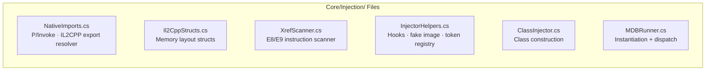
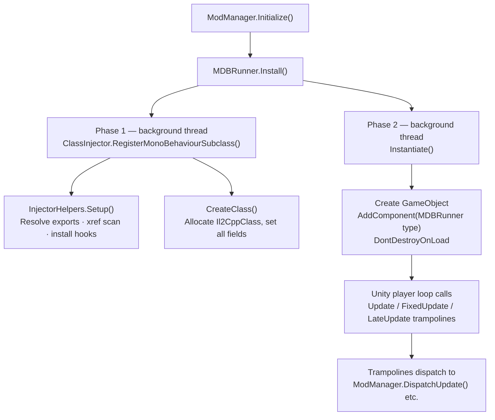
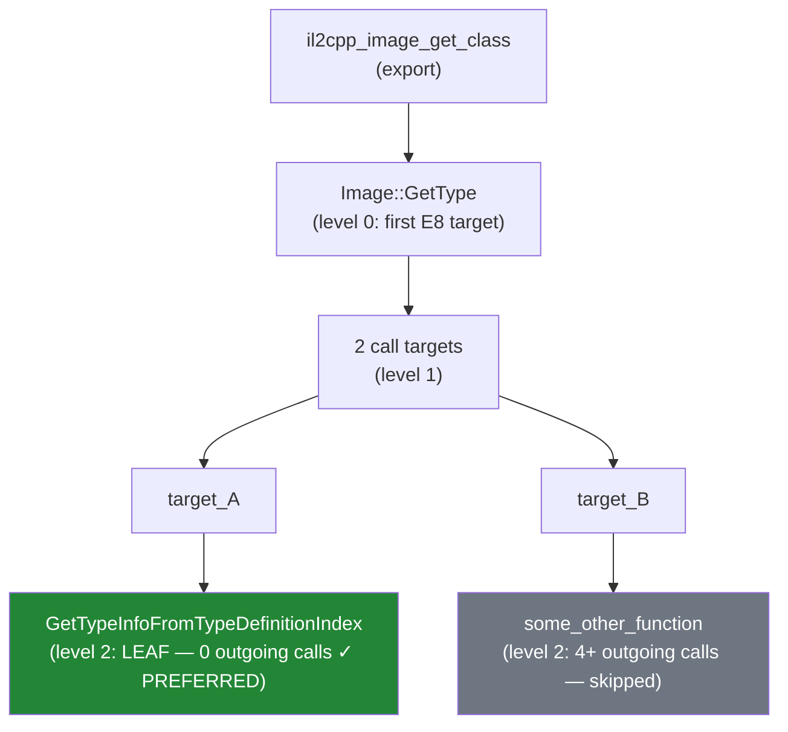

# Managed IL2CPP Class Injection — Technical Deep Dive

This guide covers how MDB Framework fabricates a **MonoBehaviour subclass entirely in memory** by constructing the raw IL2CPP metadata structures that Unity's native runtime expects. This is necessary to get main-thread callbacks (Update, FixedUpdate, LateUpdate) inside an IL2CPP game where all C# types were compiled to native code ahead of time.

For the high-level architecture, see the [Architecture Overview]({{ '/guides/architecture' | relative_url }}). For the version.dll proxy system, see the [Proxy DLL Injection Guide]({{ '/guides/proxy-injection' | relative_url }}).

---

## Table of Contents

1. [Overview](#overview)
2. [Architecture](#architecture)
3. [IL2CPP Memory Layout Reference](#il2cpp-memory-layout-reference)
4. [Phase-by-Phase Walkthrough](#phase-by-phase-walkthrough)
5. [The Hook System](#the-hook-system)
6. [The Negative Token Strategy](#the-negative-token-strategy)
7. [Fake Image and Assembly](#fake-image-and-assembly)
8. [Class Construction](#class-construction)
9. [Method Info Creation](#method-info-creation)
10. [Vtable, Type Hierarchy, and Bitflags](#vtable-type-hierarchy-and-bitflags)
11. [Instantiation — GameObject + AddComponent](#instantiation)
12. [Crash History and Fixes](#crash-history-and-fixes)
13. [Why the GetTypeInfo Hook Must Not Be Installed](#why-the-gettypeinfo-hook-must-not-be-installed)
14. [File Inventory](#file-inventory)

---

## Overview

Unity's Update/FixedUpdate/LateUpdate callbacks only fire on MonoBehaviour subclasses attached to active GameObjects in the scene. Since we're running inside an IL2CPP-compiled game with no managed runtime to emit types into, we need to **fabricate** a MonoBehaviour subclass by constructing raw IL2CPP metadata structures.

### What We Build

- A fake `Il2CppClass` struct recognized as `MDB.Internal.MDBRunner : MonoBehaviour`
- A fake `Il2CppImage` and `Il2CppAssembly` to house the class
- Five `Il2CppMethodInfo` structs (`.ctor`, `Finalize`, `Update`, `FixedUpdate`, `LateUpdate`) pointing to managed C# delegate trampolines
- Two hooks on IL2CPP internal functions (`Class::FromIl2CppType`, `Class::FromName`) to intercept type resolution
- A VEH (Vectored Exception Handler) crash safety net for debugging

### Prior Art

This implementation is informed by [Il2CppInterop's ClassInjector](https://github.com/BepInEx/Il2CppInterop) (formerly unhollower). Key differences:

| Aspect | Il2CppInterop | MDB Framework |
|--------|--------------|---------------|
| Runtime | Mono / .NET Core (in-process) | .NET Framework 4.7.2 hosted via COM CLR |
| Hook mechanism | NativeDetour (MonoMod/Dobby) | MinHook via C++ bridge DLL |
| Token strategy | Negative integers in `byval_arg.data` | Same (adopted after debugging) |
| GetTypeInfo hook | Hooked (Mono can handle the call frequency) | **Not hooked** (crashes hosted .NET CLR) |
| Image handling | Creates minimal image with `dynamic=1` | Same, plus copies parent's `codeGenModule` pointer |

---

## Architecture



### Bootstrap Flow



---

## IL2CPP Memory Layout Reference

All offsets are for **Unity 2021+ / IL2CPP metadata v29+ / x64 Windows**.

### Il2CppClass (0x138 + vtable_count × 16 bytes)

```
┌─────────────────────────────────────────────────────────────┐
│  Il2CppClass_1 (0x00 – 0xB7, 184 bytes)                     │
├──────┬──────────────────┬────────────────────────────────────┤
│ 0x00 │ image            │ Il2CppImage* — our fake image       │
│ 0x08 │ gc_desc          │ GC descriptor                       │
│ 0x10 │ name             │ const char* "MDBRunner"             │
│ 0x18 │ namespaze        │ const char* "MDB.Internal"          │
│ 0x20 │ byval_arg        │ Il2CppType (16 bytes)               │
│      │   .data          │ IntPtr → negative token (-2)        │
│      │   .attrs         │ type=0x12 (CLASS), byref=0          │
│ 0x30 │ this_arg         │ Il2CppType (16 bytes)               │
│      │   .data          │ IntPtr → same negative token (-2)   │
│      │   .attrs         │ type=0x12 (CLASS), byref=1          │
│ 0x40 │ element_class    │ self-pointer (= newClass)           │
│ 0x48 │ castClass        │ self-pointer (= newClass)           │
│ 0x50 │ declaringType    │ NULL (top-level class)              │
│ 0x58 │ parent           │ MonoBehaviour's Il2CppClass*        │
│ 0x60 │ generic_class    │ NULL (not generic)                  │
│ 0x68 │ typeMetadataHandle│ inherited from MonoBehaviour       │
│ 0x78 │ klass            │ self-pointer (= newClass)           │
│ 0x80 │ fields           │ NULL (no fields)                    │
│ 0x88 │ events           │ NULL (no events)                    │
│ 0x90 │ properties       │ NULL (no properties)                │
│ 0x98 │ methods          │ Il2CppMethodInfo*[5]                │
│ 0xA0 │ nestedTypes      │ NULL (no nested types)              │
├──────┴──────────────────┴────────────────────────────────────┤
│  static_fields (0xB8) + rgctx_data (0xC0) = 16 bytes         │
├──────────────────────────────────────────────────────────────┤
│  Il2CppClass_2 (0xC8 – 0x137, 112 bytes)                     │
├──────┬──────────────────┬────────────────────────────────────┤
│ 0xC8 │ typeHierarchy    │ Il2CppClass*[6] (depth 6)          │
│ 0xF8 │ instance_size    │ 32 (inherited from MonoBehaviour)   │
│ 0x118│ flags            │ 0x100001 (abstract cleared)         │
│ 0x11C│ token            │ 0x200014D (inherited, NOT -2!)      │
│ 0x120│ method_count     │ 5                                   │
│ 0x122│ property_count   │ 0                                   │
│ 0x124│ field_count      │ 0                                   │
│ 0x12A│ vtable_count     │ 4                                   │
│ 0x130│ typeHierarchyDepth│ 6                                  │
│ 0x136│ bitflags1        │ 0x61 (initialized+size_inited       │
│      │                  │       +has_finalize)                │
│ 0x137│ bitflags2        │ 0x14 (vtable_initialized            │
│      │                  │       +initialized_and_no_error)    │
├──────┴──────────────────┴────────────────────────────────────┤
│  vtable[0..3] (0x138+, 64 bytes for 4 entries)               │
│    [0] Equals    → Object::Equals (inherited)                 │
│    [1] Finalize  → our Trampoline_Finalize                    │
│    [2] GetHashCode → Object::GetHashCode (inherited)          │
│    [3] ToString  → Object::ToString (inherited)               │
└──────────────────────────────────────────────────────────────┘
```

### Il2CppMethodInfo (88 bytes, Unity 2021+)

```
┌──────┬──────────────────────┬──────────────────────────────┐
│ 0x00 │ methodPointer        │ Native function pointer       │
│ 0x08 │ virtualMethodPointer │ Same as methodPointer         │
│ 0x10 │ invokerMethod        │ v29 invoker delegate          │
│ 0x18 │ name                 │ const char*                   │
│ 0x20 │ klass                │ Il2CppClass* (our class)      │
│ 0x28 │ returnType           │ Il2CppType* (void)            │
│ 0x30 │ parameters           │ NULL (0 params)               │
│ 0x4C │ flags                │ MethodAttributes flags        │
│ 0x50 │ slot                 │ vtable slot or 0xFFFF          │
│ 0x52 │ argsCount            │ 0                             │
└──────┴──────────────────────┴──────────────────────────────┘
```

**Critical**: Unity 2021+ added `virtualMethodPointer` at offset 0x08, shifting `name` from 0x10 to 0x18, `klass` from 0x18 to 0x20, etc. Using the old layout causes the vtable name scan to read garbage and miss the Finalize override → crash on GC.

### Il2CppImage (≥0x48 bytes)

```
┌──────┬──────────────────────┬──────────────────────────────┐
│ 0x00 │ name                 │ const char* "MdbInjectedTypes"│
│ 0x08 │ nameNoExt            │ const char* (same)           │
│ 0x10 │ assembly             │ Il2CppAssembly*              │
│ 0x18 │ typeStart            │ uint32 (from parent image)   │
│ 0x1C │ typeCount            │ uint32 (from parent image)   │
│ 0x20 │ exportedTypeStart    │ uint32                       │
│ 0x24 │ exportedTypeCount    │ uint32                       │
│ 0x28 │ codeGenModule        │ Il2CppCodeGenModule* (CRITICAL) │
│ 0x30 │ ...                  │ other internal fields        │
│ 0x44 │ dynamic              │ uint8 = 1                    │
└──────┴──────────────────────┴──────────────────────────────┘
```

### Bitflags Reference

```
bitflags1 (byte at Il2CppClass + 0x136):
  bit 0 (0x01): initialized           — Class initialization complete
  bit 1 (0x02): enumtype              — Is enum
  bit 2 (0x04): is_generic            — Has generic parameters
  bit 3 (0x08): has_references        — Contains GC references
  bit 4 (0x10): init_pending          — Initialization in progress
  bit 5 (0x20): size_inited           — instance_size is valid
  bit 6 (0x40): has_finalize          — Overrides Finalize
  bit 7 (0x80): has_cctor             — Has static constructor

bitflags2 (byte at Il2CppClass + 0x137):
  bit 0 (0x01): is_blittable
  bit 1 (0x02): is_import_or_winrt
  bit 2 (0x04): is_vtable_initialized — vtable entries are valid
  bit 3 (0x08): has_initialization_error
  bit 4 (0x10): initialized_and_no_error — Ready for use
```

---

## Phase-by-Phase Walkthrough

### Phase 1: Class Registration (Background Thread)

All operations in Phase 1 are pure memory allocation and writes — no Unity API calls, so they're safe from any thread.

1. **Initialize trampolines**: Create managed delegates for `.ctor`, `Finalize`, `Update`, `FixedUpdate`, `LateUpdate`, and the v29 Invoker. Pin all via `GCHandle.Alloc()` to prevent GC collection. Extract native function pointers via `Marshal.GetFunctionPointerForDelegate()`.

2. **Find MonoBehaviour**: Call `mdb_find_class("UnityEngine.CoreModule", "UnityEngine", "MonoBehaviour")` via the C++ bridge.

3. **Setup hooks** (idempotent): Resolve IL2CPP exports, find internal functions via xref scanning, install MinHook detours.

4. **Force parent init + disable GC**: Call `il2cpp_runtime_class_init(monoBehaviour)` and `il2cpp_gc_disable()`.

5. **Create class**: Full copy of MonoBehaviour's class memory, then override identity, types, methods, vtable, hierarchy, and flags.

6. **Re-enable GC**.

### Phase 2: Instantiation (Background Thread)

7. **Create GameObject**: `il2cpp_object_new(GameObjectClass)` + invoke `.ctor(string)`.

8. **Get type objects**: `il2cpp_class_get_type(injectedClass)` → `il2cpp_type_get_object(type)` → `System.Type`.

9. **AddComponent**: `il2cpp_runtime_invoke(AddComponent, gameObj, [typeObj])`.

10. **DontDestroyOnLoad**: `il2cpp_runtime_invoke(DontDestroyOnLoad, null, [gameObj])`.

After Phase 2, Unity's player loop automatically calls our `Update`/`FixedUpdate`/`LateUpdate` trampolines every frame, which dispatch to `ModManager.DispatchUpdate()` etc.

---

## The Hook System

### Why Hooks Are Needed

When Unity's `AddComponent` receives our injected type, it internally calls `Class::FromIl2CppType(klass->byval_arg)` to resolve the `Il2CppType` back to an `Il2CppClass*`. Since our type has a fabricated `data` field (negative token), the original function would crash. We intercept this call and return our class pointer directly.

### Export → Internal Resolution

IL2CPP exports are thin wrappers around internal functions:

```
il2cpp_class_from_il2cpp_type(type)           // export
  → Class::FromIl2CppType(type, false)        // internal — THIS is what we hook
```

We can't hook the export (it might be called via the vtable or inlined). We must hook the **internal function**. To find it, we scan the export function's bytes for `E8` (CALL rel32) or `E9` (JMP rel32) instructions and follow the target. This is what `XrefScanner.GetFirstTarget()` does.

### Hook 1: Class::FromIl2CppType (INSTALLED)

```
Signature: Il2CppClass* FromIl2CppType(Il2CppType* type, bool throwOnError)
```

**Logic**: Read `type->data` (first 8 bytes). If the value is negative, look up in `s_InjectedClasses` dictionary and return the registered class pointer. Otherwise, call the original function via cached trampoline delegate.

Cold path — called during type resolution, not every frame. Safe for managed hooks.

### Hook 2: Class::FromName (INSTALLED)

```
Signature: Il2CppClass* FromName(Il2CppImage* image, const char* ns, const char* name)
```

**Logic**: Call original first. If it returns null, check `s_ClassNameLookup` dictionary. We register our class against every loaded assembly image, so any lookup for `"MDB.Internal"."MDBRunner"` finds our class regardless of which image the caller specifies.

Also a cold path — only called during class-by-name resolution.

### Hook 3: GetTypeInfoFromTypeDefinitionIndex (RESOLVED BUT NOT INSTALLED)

```
Signature: Il2CppClass* GetTypeInfoFromTypeDefinitionIndex(int32_t index)
```

Extremely hot path — called thousands of times per frame. **We do not install this hook.** See [Why the GetTypeInfo Hook Must Not Be Installed](#why-the-gettypeinfo-hook-must-not-be-installed).

### Finding GetTypeInfoFromTypeDefinitionIndex via XrefScanner

This function isn't directly exported. We find it via a multi-level xref chain:



**Critical insight**: `GetTypeInfoFromTypeDefinitionIndex` is a **leaf function** — it does table lookups with no outgoing calls. We prefer leaf candidates over chain candidates. An earlier bug selected a non-leaf candidate at a different RVA, which was the wrong function entirely.

---

## The Negative Token Strategy

### The Problem

In IL2CPP v29+, `Il2CppType.data` is a direct pointer to an `Il2CppTypeDefinition` in the global metadata. When internal code resolves a type, it reads this pointer and dereferences it. For injected classes, there is no valid TypeDefinition in the metadata tables.

### Failed Approach: Fake TypeDefinition Pointer

The initial approach allocated a fake TypeDefinition struct on the heap and put its pointer in `byval_arg.data`. This crashed because Unity's internal code reads `[image->codeGenModule + 0x14]` as part of type resolution — the pointer math doesn't work with heap-allocated fake definitions.

### Working Approach: Negative Tokens

Instead of a fake pointer, we store a **negative integer** in `byval_arg.data` and `this_arg.data`:

```csharp
long token = -2;  // from atomic counter: Interlocked.Decrement(ref s_tokenCounter)
IntPtr tokenAsPtr = new IntPtr(token);  // 0xFFFFFFFFFFFFFFFE on x64

Marshal.WriteIntPtr(newClass, 0x20, tokenAsPtr);  // byval_arg.data
Marshal.WriteIntPtr(newClass, 0x30, tokenAsPtr);  // this_arg.data
```

Why this works:
- Valid TypeDefinitionIndex values are always ≥ 0
- Negative values are impossible metadata indices
- Our `FromIl2CppType` hook checks `data.ToInt64() < 0` — if true, look up our class
- No code path tries to dereference a negative value as a pointer

### What NOT to Put the Negative Token In

**`Il2CppClass_2.token`** (offset 0x11C) must NOT contain the negative token. Unity's `AddComponent` reads `klass->token` as a metadata table index in a different code path (one that doesn't go through `FromIl2CppType`). Writing `0xFFFFFFFE` here causes it to index past the end of a metadata array → NULL → crash.

**Solution:** Keep MonoBehaviour's original token value (inherited via memcpy). It's valid metadata and the code paths that use it work correctly because they resolve to MonoBehaviour's real type definition.

---

## Fake Image and Assembly

### Why a Fake Image Exists

Every `Il2CppClass` points to an `Il2CppImage` (offset 0x00). If we pointed to a real image (e.g., `UnityEngine.CoreModule`), code enumerating that image's types might encounter our class at an unexpected index, causing crashes. A separate fake image isolates our injected classes.

### The codeGenModule Problem

Initially, the fake image had only three fields set: `name`, `assembly`, and `dynamic=1`. Everything else was zero — including `codeGenModule` at offset 0x28. Unity's `AddComponent` code path goes through a metadata resolver that reads `image->codeGenModule` and dereferences it:

```asm
mov rax, [rcx+0x28]     ; rax = image->codeGenModule = NULL (zeroed)
; ... later ...
movsxd rdx, [rax+0x14]  ; CRASH: [NULL + 0x14]
```

### The Fix

Copy bytes 0x18–0x43 from MonoBehaviour's real image into the fake image. This gives us valid `typeStart`, `typeCount`, `exportedTypeStart`, `exportedTypeCount`, and critically `codeGenModule`:

```csharp
IntPtr parentImage = Marshal.ReadIntPtr(parentClass, 0x00);
unsafe
{
    byte* dst = (byte*)FakeImage.ToPointer();
    byte* src = (byte*)parentImage.ToPointer();
    for (int i = 0x18; i < 0x44; i++) dst[i] = src[i];
}
```

---

## Class Construction

The class is created by full memcpy of MonoBehaviour's class (including vtable), then selective field overrides:

| Offset | Field | Value | Why |
|--------|-------|-------|-----|
| 0x00 | image | FakeImage | Isolate from real images |
| 0x10 | name | `"MDBRunner"` | Our class name |
| 0x18 | namespaze | `"MDB.Internal"` | Our namespace |
| 0x20 | byval_arg.data | `-2` (negative token) | Intercepted by FromIl2CppType hook |
| 0x28 | byval_arg.attrs | `0x00120000` | type=CLASS, byref=0 |
| 0x30 | this_arg.data | `-2` (same token) | Same interception |
| 0x38 | this_arg.attrs | `0x08120000` | type=CLASS, byref=1 |
| 0x40 | element_class | self | Standard for non-array classes |
| 0x48 | castClass | self | Standard |
| 0x58 | parent | MonoBehaviour | Our parent class |
| 0x68 | typeMetadataHandle | inherited | Keep MonoBehaviour's real TypeDefinition handle |
| 0x78 | klass | self | Self-referencing pointer |
| 0x80–0xA0 | fields/events/properties/nestedTypes | NULL | No members |
| 0x98 | methods | our array | Points to array of 5 MethodInfo* |
| 0xC8 | typeHierarchy | new array | [Object, ..., MonoBehaviour, MDBRunner] |
| 0x11C | token | inherited | Keep MonoBehaviour's original (0x200014D) |
| 0x118 | flags | `& ~0x80` | Clear abstract bit |
| 0x120 | method_count | 5 | Our 5 methods |
| 0x122–0x128 | property/field/event/nested counts | 0 | Prevent parent enumeration |
| 0x130 | typeHierarchyDepth | 6 | Parent (5) + 1 |
| 0x136 | bitflags1 | `0x61` | initialized + size_inited + has_finalize |
| 0x137 | bitflags2 | `0x14` | vtable_initialized + initialized_and_no_error |

---

## Method Info Creation

Five `Il2CppMethodInfo` structs are allocated (88 bytes each, zeroed then filled):

| Method | Pointer | Flags | Slot | Purpose |
|--------|---------|-------|------|---------|
| `.ctor` | Trampoline_Ctor | 0x1886 (Public RTSpecialName) | 0xFFFF | No-op, called after object_new |
| `Finalize` | Trampoline_Finalize | 0x00C4 (Family Virtual) | set by vtable | No-op, prevents GC crash |
| `Update` | Trampoline_Update | 0x0086 (Public Virtual) | 0xFFFF | Dispatches to ModManager |
| `FixedUpdate` | Trampoline_FixedUpdate | 0x0086 | 0xFFFF | Dispatches to ModManager |
| `LateUpdate` | Trampoline_LateUpdate | 0x0086 | 0xFFFF | Dispatches to ModManager |

### Unity 2021+ MethodInfo Layout Shift

`virtualMethodPointer` was inserted at offset 0x08, shifting every subsequent field:

```
Pre-2021:  methodPointer(0x00), invoker(0x08), name(0x10), klass(0x18), ...
2021+:     methodPointer(0x00), virtualMethodPointer(0x08), invoker(0x10), name(0x18), klass(0x20), ...
```

Using the old layout puts the `name` pointer at 0x10 (where the invoker should be), causing the vtable scanner to read the invoker function pointer as a string pointer → garbage name → can't find `"Finalize"` → no vtable override → crash on GC.

### v29 Invoker

IL2CPP v29+ uses a different invoker signature:

```csharp
// v29 invoker: void Invoke(void* methodPointer, MethodInfo* method, 
//                           void* obj, void** args, void* returnValue)
private static void VoidMethodInvoker(IntPtr methodPointer, IntPtr methodInfo, 
                                       IntPtr obj, IntPtr args, IntPtr returnValue)
{
    if (methodPointer == IntPtr.Zero) return;
    var fn = Marshal.GetDelegateForFunctionPointer<InstanceMethodDelegate>(methodPointer);
    fn(obj, methodInfo);
}
```

### Update/FixedUpdate/LateUpdate Are NOT Virtual

These are **Unity messages**, not virtual method overrides. Unity finds them by scanning a class's `methods` array for matching names. They do NOT need vtable slots — they exist in the methods array (offset 0x98) but not in the vtable.

Only `Finalize` needs a vtable override (slot 1 in Object's vtable, which MonoBehaviour inherits).

---

## Vtable, Type Hierarchy, and Bitflags

### Vtable

MonoBehaviour inherits Object's 4-entry vtable:

| Slot | Method | Action |
|------|--------|--------|
| 0 | Equals | Inherited (no change) |
| 1 | Finalize | **Overridden** with our Trampoline_Finalize |
| 2 | GetHashCode | Inherited |
| 3 | ToString | Inherited |

The vtable override writes both the `methodPtr` (native function pointer) and `method` (our MethodInfo*) into the vtable slot. Our MethodInfo's `slot` field is also updated to match.

### Type Hierarchy

Built as an array of `Il2CppClass*`, depth 6:

```
[0] System.Object
[1] UnityEngine.Object
[2] UnityEngine.Component
[3] UnityEngine.Behaviour
[4] UnityEngine.MonoBehaviour
[5] MDB.Internal.MDBRunner        ← new entry
```

Copied from MonoBehaviour's hierarchy (first 5 entries) + our class appended.

### Bitflags

Read from parent (MonoBehaviour has bf1=0x21, bf2=0x00), then OR in needed bits:

- **bf1 |= 0x40**: `has_finalize` — we override Finalize. Without this, the GC won't call our Finalize trampoline.
- **bf2 |= 0x04**: `is_vtable_initialized` — vtable entries are valid, don't rebuild.
- **bf2 |= 0x10**: `initialized_and_no_error` — class is fully ready.

Early attempts hardcoded wrong values (0x85/0x11) which set bits like `has_cctor` (triggering calls to a non-existent static constructor). The correct approach is to inherit parent values and only OR in additional bits.

---

<a name="instantiation"></a>
## Instantiation — GameObject + AddComponent

### Creating the GameObject

```csharp
IntPtr gameObj = Il2CppBridge.mdb_object_new(gameObjectClass);
IntPtr nameStr = Il2CppBridge.mdb_string_new("__MDB_Runner");
Il2CppBridge.mdb_invoke_method(ctorMethod, gameObj, new[] { nameStr }, out exception);
```

### AddComponent

We pass a `System.Type` object (not an `Il2CppClass*`):

```csharp
IntPtr injectedType = Il2CppBridge.mdb_class_get_type(s_injectedClass);    // Il2CppType*
IntPtr typeObj = Il2CppBridge.mdb_type_get_object(injectedType);           // System.Type
IntPtr result = Il2CppBridge.mdb_invoke_method(addComponentMethod, gameObj, 
                                                new[] { typeObj }, out exception);
```

Internally, `AddComponent` calls `Class::FromIl2CppType(type->byval_arg)`. Our hook intercepts this because `byval_arg.data = -2` (negative), looks up the class in `s_InjectedClasses`, and returns our fabricated class pointer.

### DontDestroyOnLoad

```csharp
Il2CppBridge.mdb_invoke_method(dontDestroyMethod, IntPtr.Zero, new[] { gameObj }, out exception);
```

Static method call (null `this`). Prevents the GameObject and MDBRunner component from being destroyed on scene transitions.

### Crash Safety

The AddComponent call is wrapped in:
1. **VEH**: Captures x64 register state and stack dump on AccessViolation, writes to `crash_diag.log`
2. **`[HandleProcessCorruptedStateExceptions]`**: Allows managed catch blocks to handle CSEs
3. **Try/catch with AccessViolationException**: Prevents the game from dying if AddComponent fails

---

## Crash History and Fixes

Eight distinct bugs were found and fixed through binary analysis of GameAssembly.dll. Each is documented with symptoms, root cause, and fix.

### Fix 1: MethodInfo Layout — virtualMethodPointer at 0x08

**Symptom**: Vtable scanner couldn't find `"Finalize"` — all method names were garbage.

**Root cause**: Unity 2021+ inserted `virtualMethodPointer` at offset 0x08, shifting `name` from 0x10 to 0x18. We were reading the invoker pointer as a string pointer.

**Fix**: Updated all MethodInfo field writes to 2021+ layout offsets.

### Fix 2: Missing Parent Field

**Symptom**: Crash during class initialization — typeHierarchy traversal failed.

**Root cause**: The `parent` field (offset 0x58) wasn't being set. After zeroing and partial copies, it was NULL.

**Fix**: `Marshal.WriteIntPtr(newClass, 0x58, parentClass)`.

### Fix 3: Wrong Bitflags

**Symptom**: Inconsistent crashes during various internal checks.

**Root cause**: Hardcoded bf1=0x85 set `has_cctor` (bit 7) → runtime calls non-existent static constructor. Hardcoded bf2=0x11 set `is_blittable` → incorrect marshaling.

**Fix**: Read parent's flags, OR in only needed bits: `bf1 |= 0x40`, `bf2 |= 0x14`.

### Fix 4: Fake TypeDefinition Replaced with Negative Tokens

**Symptom**: Crash at RVA 0x2195FF — `movsxd rdx, [rax+0x14]` where RAX=NULL.

**Root cause**: Heap-allocated fake TypeDefinition in `byval_arg.data` — Unity's metadata resolver reads `image->codeGenModule` based on the TypeDefinition and the pointer math produces NULL.

**Fix**: Negative token approach. `byval_arg.data = this_arg.data = IntPtr(-2)`. `FromIl2CppType` hook checks `data < 0` and returns class directly.

### Fix 5: Wrong XrefScanner Candidate

**Symptom**: GetTypeInfo hook fired but was hooking the wrong function.

**Root cause**: XrefScanner preferred "chain candidates" (functions with outgoing calls) over "leaf candidates" (no outgoing calls). `GetTypeInfoFromTypeDefinitionIndex` is a leaf function.

**Fix**: Select leaf candidates first, chain candidates as fallback.

### Fix 6: Negative Token in Il2CppClass_2.token

**Symptom**: Same crash at RVA 0x2195FF. Register dump showed token=0xFFFFFFFE being used as metadata index.

**Root cause**: Writing -2 to `Il2CppClass_2.token` (offset 0x11C). `AddComponent` reads this directly as a metadata table index (not through `FromIl2CppType`). Index 0xFFFFFFFE → past end of array → NULL → crash.

**Fix**: Don't write to the token field. Keep MonoBehaviour's original token from memcpy.

### Fix 7: Fake Image Missing codeGenModule

**Symptom**: Same crash at RVA 0x2195FF. Crash function reads `[arg1+0x28]` → NULL.

**Root cause**: The metadata resolver receives the image and reads `image->codeGenModule` (offset +0x28), which was NULL in our zeroed fake image.

**Binary analysis**:
```asm
; RVA 0x2195C0
mov rax, [rcx+0x28]        ; codeGenModule → NULL!
movsxd rdx, [rax+0x14]     ; CRASH: [NULL+0x14]
```

**Fix**: Copy bytes 0x18–0x43 from MonoBehaviour's real image into the fake image.

### Fix 8: GetTypeInfo Hook Crashes Hosted CLR

**Symptom**: Game runs for 10–30 seconds, then `System.AccessViolationException` in the hook.

**Root cause**: Three compounding problems:
1. `Marshal.GetDelegateForFunctionPointer<T>()` called on every invocation (thousands/frame) → massive GC pressure
2. Delegate could be collected between creation and use
3. Native→managed→native transition corrupts COM-hosted CLR state over time
4. `[HandleProcessCorruptedStateExceptions]` doesn't reliably work in COM-hosted CLR

**Fix**: Don't install the hook. Testing confirmed it never fires for our class — all negative token resolution goes through `FromIl2CppType`.

---

## Why the GetTypeInfo Hook Must Not Be Installed

### The Problem

`MetadataCache::GetTypeInfoFromTypeDefinitionIndex(int32_t index)` is called **thousands of times per frame**. When hooked with a managed C# delegate:

1. Every call transitions: native → CLR thunk → managed → CLR thunk → native trampoline
2. Each transition involves: frame setup, delegate resolution, GC safe point checks, frame teardown
3. The CLR is hosted via COM (`ICLRRuntimeHost`) — stack unwinding and exception handling are fragile
4. Over time (10–30 seconds), accumulated overhead corrupts internal CLR state

### Why It's Not Needed

Our class uses negative tokens in `byval_arg.data` and `this_arg.data`. Resolution goes through `FromIl2CppType`, which we hook. We keep MonoBehaviour's original `token` and `typeMetadataHandle` — no field contains a negative value that would be used as a TypeDefinitionIndex.

Testing with a diagnostic flag confirmed zero calls to `GetTypeInfo` were logged during `AddComponent` or normal gameplay.

### If Needed in the Future

Implement in **native C++** where the overhead is negligible:

```cpp
static Il2CppClass* Hook_GetTypeInfo(int32_t index) {
    if (index < 0) {
        auto it = s_injected_classes.find(index);
        if (it != s_injected_classes.end()) return it->second;
    }
    return original_GetTypeInfo(index);
}
```

---

## File Inventory

### Core/Injection/ (6 files)

| File | Lines | Purpose |
|------|-------|---------|
| `NativeImports.cs` | 270 | kernel32 P/Invoke, IL2CPP export resolution with obfuscated name support, PE export table enumeration, VEH imports |
| `Il2CppStructs.cs` | 264 | `[StructLayout(Explicit)]` structs for Il2CppType, Il2CppClass_1, Il2CppClass_2, Il2CppMethodInfo, VirtualInvokeData, Il2CppObject. Helper methods for reading/writing structs. |
| `XrefScanner.cs` | 188 | Minimal x86-64 scanner: decodes E8 (CALL) and E9 (JMP) instructions. `GetCallTargets()`, `GetFirstTarget()`, `FollowSingleXref()`, `ResolveGetTypeInfoFromTypeDefinitionIndex()` with leaf-first selection. |
| `InjectorHelpers.cs` | ~450 | Hook management (MinHook detours via bridge), fake image/assembly creation (with parent image copying), negative token registry, name lookup registry, hook implementations. |
| `ClassInjector.cs` | 658 | Core class construction: trampoline delegates, managed callbacks, class memory allocation, method info creation, vtable override (Finalize), type hierarchy, bitflags. |
| `MDBRunner.cs` | 470 | Two-phase install, VEH crash handler with register dump, GameObject/AddComponent/DontDestroyOnLoad, Update/FixedUpdate/LateUpdate dispatch to ModManager. |

---

[← Proxy DLL Injection]({{ '/guides/proxy-injection' | relative_url }}) | [Back to Guides]({{ '/guides' | relative_url }})
